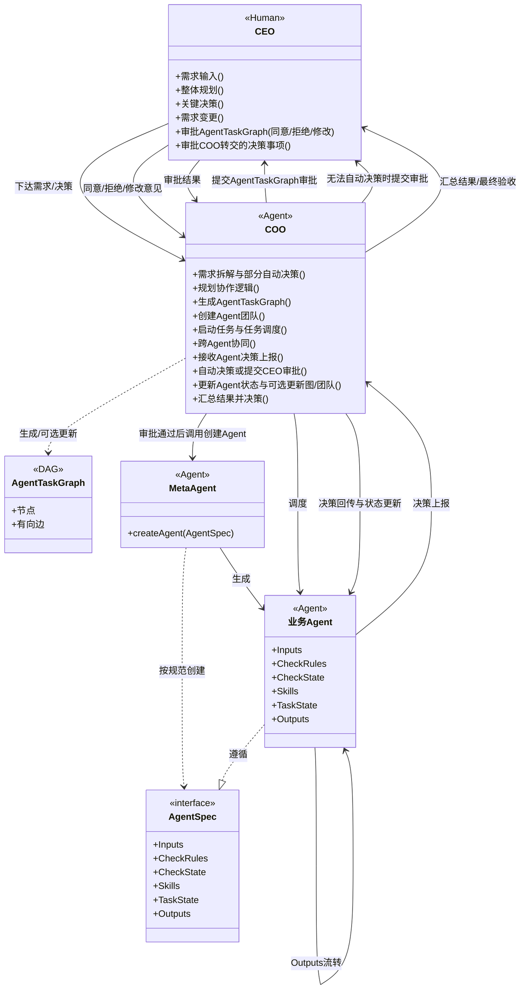

# OPC-org（One Person Company）多智能体架构文档

## 1. 架构概述

OPC-org（One Person Company）是一种**单人驱动的多智能体协作架构**，通过将人类角色与 AI 智能体分层，实现“人类决策 + AI 执行”的高效单人公司运作模式。**CEO 仅与 COO 交互**，业务 Agent 遇需决策事项统一上报 COO，由 COO 自动决策或转交 CEO 审批，审批结果经 COO 回传并更新 Agent 状态。核心目标是用标准化的智能体协作，替代传统公司的多人分工，让单个创业者高效完成复杂业务。

---

## 2. 顶层角色与职责

| 角色          | 类型              | 核心职责                                                                                                                                                                                                                                                                                                                                                                                            |
| ------------- | ----------------- | --------------------------------------------------------------------------------------------------------------------------------------------------------------------------------------------------------------------------------------------------------------------------------------------------------------------------------------------------------------------------------------------------- |
| **CEO** | 人类（Human）     | 业务需求输入、整体规划、关键决策、需求变更；**仅与 COO 交互**：审批 COO 提交的 AgentTaskGraph（同意/拒绝/修改意见）、审批 COO 转交的无法自动决策事项；最终验收与需求迭代。**禁止**与业务 Agent 直接交互                                                                                                                                                                                 |
| **COO** | AI智能体（Agent） | 接收需求→需求拆解与部分自动决策→规划协作逻辑→**生成任务流 AgentTaskGraph** 并提交 CEO 审批；审批通过后：创建 Agent 团队、启动任务、任务调度、跨 Agent 协同。**决策枢纽**：业务 Agent 遇需决策事项**仅上报 COO**；COO 可依全局知识与信息自动决策，无法决策时再提交 CEO 审批；根据审批/决策结果**必须**更新上报 Agent 的状态，**可选**更新 AgentTaskGraph、AgentTeam |

**架构约束**：CEO 仅与 COO 交互；业务 Agent 禁止直接与 CEO 交互，所有需决策事项必须经 COO 上报或由 COO 代为请求 CEO 审批。

---

## 3. 执行层：Agent Team 结构

执行层由**MetaAgent**与多个业务Agent组成，所有Agent均遵循统一规范 `AgentSpec`：

```
Agent Team
├── MetaAgent：负责创建符合AgentSpec的业务Agent，本身也符合AgentSpec
├── Agent 1：业务执行单元1（符合AgentSpec）
├── Agent 2：业务执行单元2（符合AgentSpec）
│   ...
└── Agent N：业务执行单元N（符合AgentSpec）
```

### 3.1 MetaAgent

- 功能：根据COO的任务需求，**生成符合 `AgentSpec`规范的业务Agent**
- 作用：保证生成的Agent符合COO下发的任务需求，保证所有执行单元的接口一致性，实现Agent的可插拔、可复用
- 约束：**必须实现 AgentSpec**（Inputs/CheckRules/CheckState/Skills/TaskState/Outputs），不得因 MVP 而简化；确保与COO、其他Agent的协作兼容性

### 3.2 业务Agent（Agent 1~N）

- 功能：独立完成特定业务逻辑的执行单元
- 约束：必须严格遵循 `AgentSpec`接口规范，确保与COO、其他Agent的协作兼容性

---

## 4. 核心规范：AgentSpec

`AgentSpec`是所有Agent必须遵守的接口标准，定义了Agent的输入、校验、动作与输出规则：

```yaml
AgentSpec:
  Inputs: (I₁, I₂, ..., Iₖ)  # 接收的业务参数/数据
  CheckRules: (R₁, R₂, ..., Rₖ) # 输入合法性、前置条件校验规则
  CheckState: (C₁, C₂..., Cₖ)   # Rₖ对Iₖ的检测结果，pending → running → succeed / failed / cancelled / timeout
  Skills: (S₁, S₂..., Sₘ)    # 可执行的业务能力集合（含工具、脚本等）
  TaskState: (T₁, T₂..., Tₘ)   # Sₘ的执行结果，pending → running → succeed / failed / cancelled / timeout
  Outputs:
    - O₁ → A₁  # 输出O₁以及对应的下游AgentA₁
    - O₂ → A₂  # 输出O₂以及对应的下游AgentA₂
    - ...
    - Oₙ → Aₙ  # 输出Oₙ以及对应的下游AgentAₙ
  Constraints:
    - CheckState中如果存在任意1个检测结果C₁不合法（failed / cancelled / timeout），则：当前Agent运行终止；取消所有Skills并更新TaskState；将错误信息传回上一个Agent；上一个Agent以（原输入I₁ + 回退的错误信息）重新运行。
    - Outputs 是多个有向无环图，用于跨 Agent 协作流转，这些图属于 COO 生成的 AgentTaskGraph 的子图
```

### 4.1 AgentSpec 与 Template 强约束（设计选项）

可为 AgentSpec 配套 **Template**（如 JSON Schema、CheckState 枚举白名单、Inputs/Outputs 结构模板），在 **Agent 创建与运行阶段**（对应 §5 步骤 4、6）对 action package（AgentSpec 的具象表示，见 §9）做**强约束**——必填字段、合法状态集合、输出形态等——使 MetaAgent/COO 生成与流转的实例严格符合规范。

| 维度           | 说明                                                                                                                                                                                                                                                                                                    |
| -------------- | ------------------------------------------------------------------------------------------------------------------------------------------------------------------------------------------------------------------------------------------------------------------------------------------------------- |
| **优势** | **可校验性**：创建时与节点间可做 schema 校验，非法状态/缺字段早失败，便于排错；**一致性**：序列化/反序列化与跨 Agent 传递格式统一，减少对接歧义；**可生成性**：COO/MetaAgent 可按模板生成合规 AgentSpec 实例，降低手写错误；**可观测**：日志与审计可依赖固定结构做解析与监控    |
| **劣势** | **灵活性下降**：新业务或探索型 Agent 若需非常规 Inputs/Outputs，易被模板卡住，需频繁改模板或开例外；**演进成本**：模板一旦成为契约，新增字段或状态需兼容旧实例与下游，版本与迁移成本增加；**过度约束风险**：强约束若设计过细，可能把「实现细节」写进规范，不利于 Agent 可替换与多实现 |

**决策依据**：

- **建议引入 Template 强约束**：生产级、固定 DAG 的 AgentTaskGraph（如内容日历、单篇文章流水线）；COO/MetaAgent 自动创建 action 的路径；需要与飞书/存储等外部系统稳定对接的 action package 形态。此时强约束带来的可校验性与一致性收益大于灵活性损失。
- **建议保持规范最小化、不绑定模板**：一次性或强探索型流程；尚未稳定的新节点形态；仅内部使用的实验性 Agent。可先遵守 §4 抽象规范与 Constraints，待形态稳定后再抽取 Template。
- **折中**：定义**分层 Template**——核心层（CheckState 枚举、必填 status/execution）强约束；扩展层（Inputs 内业务字段、Outputs 的 payload 结构）用可选 schema 或文档约定，便于渐进收紧。实现上可先对状态与 execution 做校验，再逐步扩展至 Inputs/Outputs 的 schema。

---

## 5. 协作流程

1. **需求输入**：CEO 提出业务需求
2. **任务规划**：COO 接收需求，完成**需求拆解与部分自动决策**，**规划协作逻辑**，**生成任务流 AgentTaskGraph**（智能体协作图，有向无环图）
3. **CEO 审批任务图**：COO 将生成的 AgentTaskGraph 提交给 CEO 审批；CEO 可**同意**、**拒绝**或提出**修改意见**；仅当 CEO 同意后，才进入后续步骤
4. **Agent 创建**：审批通过后，COO 根据 `AgentTaskGraph`所需的所有业务Agent，调用 MetaAgent，按 `AgentSpec` 创建所需业务 Agent（创建 Agent 团队）
5. **启动与调度**：COO 启动任务、进行任务调度与跨 Agent 协同
6. **业务执行与决策上报**：各 Agent 按 `AgentSpec` 接收输入→校验→执行动作→输出结果。若执行中遇到需决策的事项，**仅能上报 COO**：COO 可依全局知识与信息自动决策，若无法决策则提交 CEO 审批；COO 根据决策/审批结果更新该 Agent 的状态，并可选择更新 AgentTaskGraph 或 AgentTeam（也可不更新），再将结果回传该 Agent，由其继续执行
7. **结果流转**：Agent 输出按 `AgentTaskGraph` 分发至下一个 Agent，直至业务完成
8. **结果反馈**：COO 根据**CEO 初始任务信息**、**审批通过的 AgentTaskGraph**、**各叶子 Agent 返回结果**做综合判断（需设计决策 prompt）；若不满足目标，则回退到 2 并同步给 CEO；若满足，则发给 CEO 进行最终 human 验收或需求迭代

---

## 6. UML 类图（架构可视化）



---

## 7. 架构优势

- **标准化**：`AgentSpec`统一接口（Inputs/CheckRules/Skills/Outputs），实现Agent可插拔、可复用、可替换
- **单一决策网关**：CEO 仅对 COO，业务 Agent 不直连 CEO；决策统一经 COO 自动处理或转交 CEO 审批，便于权限收敛、审计与状态一致
- **高效协作**：COO 负责生成任务流、调度协同与决策枢纽；人类 CEO 专注需求与关键审批，降低执行成本
- **可观测与回退**：`CheckState`与 `TaskState`显式追踪校验与执行状态，异常时按约束取消Skills并回退至上游Agent
- **灵活扩展**：新增业务只需通过MetaAgent创建符合 `AgentSpec`的新Agent、更新 `AgentTaskGraph`，无需重构整体架构
- **单人赋能**：用标准化的智能体协作替代多人分工，让单个创业者高效完成复杂业务

---

## 8. Cursor Agent CLI 集成

执行层 Agent（含 MetaAgent、业务 Agent）可将 **Cursor Agent CLI** 作为 Skill 调用，用于代码生成、重构、探索等能力。

### 8.1 CLI 路径

本项目中 Cursor Agent 可执行文件路径（按需通过环境变量或配置覆盖）：

```
/Users/xuejiao/.local/bin/agent
```

### 8.2 配置与使用

- **非交互调用**：在脚本/流水线中调用时使用 `-p` / `--print`，输出到 stdout，便于 COO 或下游 Agent 解析。
- **结构化输出**：配合 `--output-format json` 或 `--output-format text` 控制格式，便于与 AgentSpec 的 TaskState/Outputs 对接。
- **工作区**：通过 `--workspace <dir>` 指定本次任务的工作目录。
- **认证**：可使用 `--api-key` 或环境变量 `CURSOR_API_KEY`（密钥仅应在调用点注入，禁止写死在模块顶层）。

示例（非交互、仅打印结果）：

```bash
/Users/xuejiao/.local/bin/agent -p "你的任务描述" --output-format text --workspace /path/to/project
```

业务包在注册 Agent 配置（`register_agent_config`）或 execution 时，可将上述路径作为 Skill 的可执行入口之一，由 COO 在调度时注入或由业务 Agent 按 AgentSpec 执行。

### 8.3 任务级别配置

在单个任务（action 节点）上可挂载 Cursor Agent 的调用参数，供执行层在调用 CLI 时使用。推荐放在 **action package** 的 `execution.cursor_agent` 下，由 COO 或业务 Agent 在运行该节点时读取并拼成 CLI 参数。

| 配置键 | CLI 参数 | 类型 | 说明 |
|--------|----------|------|------|
| `executable_path` | （可执行文件路径） | string | 默认 `CURSOR_AGENT_PATH` 或 `/Users/xuejiao/.local/bin/agent`，可被环境变量覆盖 |
| `model` | `--model` | string | 使用的模型，不设则用 Cursor 默认 |
| `mode` | `--mode` | `plan` \| `ask` \| agent | 模式：plan=先规划，ask=只读不写，不传=默认 agent |
| `output_format` | `--output-format` | `text` \| `json` \| `stream-json` | 仅与 `-p` 同用，脚本化时常用 `text` 或 `json` |
| `workspace` | `--workspace` | string | 本次任务的工作目录（绝对路径） |
| `print` | `-p` / `--print` | bool | 非交互模式，输出到 stdout，脚本/流水线必开 |
| `force` | `-f` / `--force`（`--yolo`） | bool | 是否自动批准终端命令，慎用 |
| `sandbox` | `--sandbox` | `enabled` \| `disabled` | 沙箱开关 |
| `trust` | `--trust` | bool | 无头模式下信任工作区不二次确认 |
| `cloud` | `-c` / `--cloud` | bool | 是否使用 Cloud Agent |
| `resume` | `--resume` [chatId] | string? | 恢复已有会话，传 chatId；`--continue` 等价于 `--resume=-1` |
| `approve_mcps` | `--approve-mcps` | bool | 是否自动批准所有 MCP 服务器 |
| `stream_partial_output` | `--stream-partial-output` | bool | 仅在与 `--output-format stream-json` 同用时有效，流式输出 |

**不建议放在任务配置中的参数**（应在调用点或环境注入）：

- `--api-key` / `CURSOR_API_KEY`：认证信息，仅通过环境变量或运行时注入，禁止写入 action 或版本库。
- `-H` / `--header`：按需在调用处添加。

**示例：action 中的任务级配置**

```yaml
execution:
  owner_agent: "cursor_runner"
  collaborators: []
  cursor_agent:
    executable_path: "/Users/xuejiao/.local/bin/agent"
    model: "claude-sonnet"
    mode: "agent"
    output_format: "json"
    workspace: "/path/to/project"
    print: true
    sandbox: "enabled"
```

执行层根据 `execution.cursor_agent` 拼出完整命令行，例如（prompt 来自 Inputs/objective）：

```bash
/Users/xuejiao/.local/bin/agent -p "任务描述来自 objective" \
  --output-format json --workspace /path/to/project \
  --mode agent --model claude-sonnet --sandbox enabled
```
