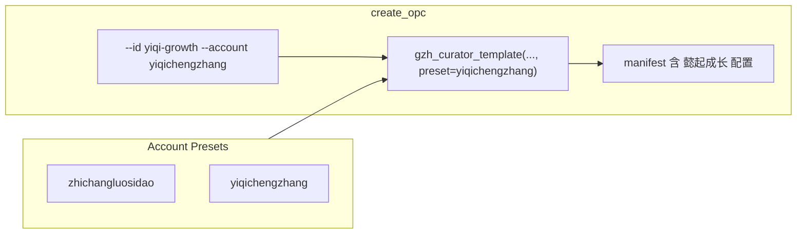

# gzh-curator 多账号架构优化方案

## 一、现状梳理

### 数据流

```mermaid
flowchart TB
    subgraph create [创建阶段]
        CLI["opc create --id gzh-curator --name ... --from-template gzh-curator"]
        loadTpl["load_template(gzh-curator)"]
        gzhTpl["gzh_curator_template()"]
        spec["weekly-topic-batch.v2.json"]
        pd["extract_planning_defaults(spec)"]
        manifest["manifest.json 写入 .opc/opcs/gzh-curator/"]
    end
    subgraph run [运行阶段]
        runCmd["scenario run --opc gzh-curator"]
        getDefaults["get_planning_defaults(opc_id)"]
        mf["manifest 覆盖 template defaults"]
        inputs["merged_inputs 传入 executor"]
    end
    CLI --> loadTpl --> gzhTpl
    gzhTpl --> spec --> pd --> manifest
    runCmd --> getDefaults --> mf --> inputs
```




### 关键发现


| 环节         | 现状                                               | 问题                                                                  |
| ---------- | ------------------------------------------------ | ------------------------------------------------------------------- |
| 模板         | 单一 `gzh-curator` 加载 `weekly-topic-batch.v2.json` | defaults 中 objective、target_account、reference_accounts 均硬编码为「职场螺丝刀」 |
| create_opc | 仅接收 `opc_id, name, template`                     | 无法为不同账号传入差异化配置                                                      |
| manifest   | 由 `gzh_curator_template()` 从 spec 提取             | 新建 OPC 时必然拿到模板中的 职场螺丝刀 配置                                           |
| 运行期        | `get_planning_defaults()` 用 manifest 覆盖 template | **manifest 是运行时默认值来源**，因此每个 OPC 应有自己的 manifest 配置                   |


**结论**：create 阶段无法为不同账号写入不同的 manifest，是核心瓶颈。当前若要支持「懿起成长」，只能手动创建后编辑 `.opc/opcs/<id>/manifest.json`，既不便捷也不易维护。

**设计原则**：不考虑历史 OPC 兼容，完全按新架构设计；已有 `.opc/opcs/` 下 OPC 若需使用新流程，需按新命令重新创建。

---

## 二、方案：Account Presets

### 2.1 思路

- 新增 **account presets** 配置，将「职场螺丝刀」「懿起成长」等账号的 objective、references、target_account、source_data_dir 等集中管理
- 扩展 `create_opc`：当 `template=gzh-curator` 时，`account_preset` **必填**，从 preset 覆盖 manifest；其他 template 暂不要求
- **场景结构与 agent 定义**保持不变；**account 相关默认值**从 template 移除，统一由 preset/manifest 提供，避免重复、困惑与错误
- **manifest 显式存 `account_preset`**：create 时写入，运行前 sync 时从 manifest 读出并传给 `load_template`，create 与 sync 共用同一套 `load_template` 逻辑，不推导
- **运行期 inputs 合并**：manifest 作 base，caller 传入的 inputs（文件/表单/CLI 覆盖）覆盖 manifest；**合并逻辑只在一个函数内实现**，run_scenario / 执行路径仅调用该函数，不做硬编码默认值回退

### 2.2 架构（优化后）




### 2.3 新增文件

`**opc_platform/templates/gzh-curator-accounts.json**`

```json
{
  "zhichangluosidao": {
    "target_account": "职场螺丝刀",
    "objective": "聊职场生存与升职技能，每日更新，每篇文章内容字数强约束在1000字-1100字。",
    "references": ["刘润", "职场知行先锋", "栩先生", "MBA智库"],
    "source_data_dir": "~/Codes/agent-skills/data",
    "display_name": "职场螺丝刀GzhCuratorOpc"
  },
  "yiqichengzhang": {
    "target_account": "懿起成长",
    "objective": "一个37岁的土木工程师爸爸，记录10岁四年级儿子大懿和7岁一年级女儿小懿的成长过程、优质陪伴和教育经验等。每日更新，每篇文章内容字数强约束在1000字-1100字。",
    "references": ["贼娃","普娃","三个妈妈六个娃","三秦家长学校"],
    "source_data_dir": "",
    "display_name": "懿起成长GzhCuratorOpc",
    "industry": "parenting-content",
    "ceo_persona": "civil engineer dad documenting family growth"
  }
}
```

- preset key 为 slug（如 `yiqichengzhang`），与 `target_account_to_slug` 生成结果一致
- `display_name` 用作 `manifest.name` 的默认值
- `source_data_dir` 本期纳入 account 扩展，不同账号可配置不同预抓取目录；空字符串表示走抓取流程
- **可选** `industry`、`ceo_persona`：覆盖 manifest 对应字段；未配置时使用模板默认值（`career-content`、`professional civil engineer`）

---

## 三、实现要点

### 3.1 修改清单


| 文件                                                                                                     | 变更                                                                                                                                                                                                                                                                 |
| ------------------------------------------------------------------------------------------------------ | ------------------------------------------------------------------------------------------------------------------------------------------------------------------------------------------------------------------------------------------------------------------ |
| [opc_platform/templates/weekly-topic-batch.v2.json](opc_platform/templates/weekly-topic-batch.v2.json) | **移除与 preset 重复的 account 相关字段**：`defaults.objective`→`""`；`defaults.reference_accounts`→`[]`；`defaults.source_data_dir`→`""`；`inputs_schema.properties.target_account.default`→`""`；`inputs_schema.properties.source_data_dir.default`→`""`。详见 3.5。 |
| [opc_platform/templates/gzh-curator-accounts.json](opc_platform/templates/gzh-curator-accounts.json)   | 新建，存放账号 preset 配置                                                                                                                                                                                                                                                 |
| [opc_platform/domain/templates.py](opc_platform/domain/templates.py)                                   | 1) 新增 `load_gzh_curator_presets()`（路径 `opc_platform/templates/gzh-curator-accounts.json`）：文件不存在→`FileNotFoundError`；JSON 解析失败→`ValueError`；返回空 dict 时 preset key 校验会报错 2) `gzh_curator_template(opc_id, name, account_preset: str)` 必填 3) `load_template(..., account_preset: str | None)`：仅当 `template_name=="gzh-curator"` 时 account_preset 必填并透传；其他模板忽略 4) preset 不存在或必填字段缺失则报错 5) manifest 须包含 `account_preset`（供 sync 读取）；`industry`、`ceo_persona` 优先从 preset 读取，未配置则用模板默认值 |
| [opc_platform/commands/opc_commands.py](opc_platform/commands/opc_commands.py)                         | `create_opc(..., account_preset: str | None)` 必填（template 为 gzh-curator 时），**在 create_opc 内统一校验**（CLI/Web 行为一致）；缺省则 `raise ValueError`。写入 catalog 的 `name` 使用 `tpl["manifest"]["name"]`，与 manifest 一致。新增 `list_presets(root)`：调用 `templates.load_gzh_curator_presets()` 后 map 为 `[{"key","target_account","display_name"},...]`；root 可为占位以利后续扩展 |
| [opc_platform/entrypoints/cli.py](opc_platform/entrypoints/cli.py)                                     | `opc create` 增加 `--account`，**仅当 `--from-template gzh-curator` 时必填**；其他模板可选                                                                                                                                                                               |
| [opc_platform/commands/run_commands.py](opc_platform/commands/run_commands.py)                         | `_sync_scenario_with_template`：当 `template_name=="gzh-curator"` 时，从 manifest 读取 `account_preset`，传给 `load_template`。run_scenario 在调用 execute_run 前：加载 manifest，调用 **唯一合并函数** `merge_run_inputs(manifest, inputs)`，将返回值作为 inputs 传入 execute_run |
| [opc_platform/commands/opc_commands.py](opc_platform/commands/opc_commands.py)（合并函数）             | 新增 **唯一实现合并逻辑的函数** `merge_run_inputs(manifest: dict, inputs: dict) -> dict`：base = manifest 规划相关字段（objective、target_account、reference_accounts←manifest.references、source_data_dir、topic_days 等），返回 `{**base, **inputs}`；不做任何硬编码默认值回退。CLI/Web 仅传各自收集的 inputs，由 run_scenario 统一调用此函数 |
| [opc_platform/runtime/executor.py](opc_platform/runtime/executor.py)                                   | 移除 target_account、reference_accounts 的硬编码回退（如 "职场螺丝刀"、[]）；仅使用传入的 merged_inputs，缺则空 |
| [opc_platform/commands/web_commands.py](opc_platform/commands/web_commands.py)                         | `createOpc` 的 `account_preset` **仅当 template 为 gzh-curator 时必填**；新增 GET `/api/opc/presets` 返回 `{"presets":[{"key","target_account","display_name"},...]}`。**路由顺序**：必须在 `path.startswith("/api/opc/")` 分支之前单独处理 `path == "/api/opc/presets"`，否则会被误识别为 `describe_opc(root, "presets")` |
| [web/src/api.ts](web/src/api.ts)、[web/src/App.tsx](web/src/App.tsx) 等                                  | **必选**：`api.ts` 新增 `presets: () => req("/api/opc/presets")`；`createOpc` 的 payload 增加 `account_preset?`；config 类型增加 `default_opc_create.account_preset`。`App.tsx`：① **手动创建 OPC 表单**：放在工作台空状态（opcs.length===0）时，作为「创建 OPC 并开始」旁的次要按钮「手动创建」展开；或 OPC 下拉旁的「新建」入口；字段 opc_id、name、template、account_preset 下拉（gzh-curator 时必选）② createDefaultOpc 从 config 传入 `account_preset` ③ **空状态**：在 `planningDefaults` 的 useEffect 开头加 `if (opcs.length === 0) return`，并将 `opcs` 加入依赖；展示「暂无 OPC，请先创建」 |

### 3.2 核心逻辑（templates.py）

```python
# 伪代码（显式校验，避免 or 回退到空值）
REQUIRED = ("target_account", "objective", "references")

def gzh_curator_template(opc_id: str, name: str, account_preset: str) -> dict:
    spec = _load_weekly_spec()
    pd = extract_planning_defaults(spec)  # 模板默认值
    presets = _load_gzh_curator_presets()
    p = presets.get(account_preset)
    if not p:
        raise ValueError(f"unknown account_preset: {account_preset}")
    for key in REQUIRED:
        val = p.get("references") if key == "references" else p.get(key)
        if val is None or (isinstance(val, (list, str)) and not val):
            raise ValueError(f"preset {account_preset} missing required field: {key}")
    pd["target_account"] = p["target_account"]
    pd["objective"] = p["objective"]
    pd["reference_accounts"] = p["references"]
    pd["source_data_dir"] = str(p.get("source_data_dir") or "")
    name = str(p.get("display_name") or name)
    manifest = {
        "name": name,  # 必须显式写入，catalog 将使用此值
        "opc_id": opc_id,
        "account_preset": account_preset,  # sync 时从 manifest 读出并传给 load_template
        ...
    }  # 使用 pd 构建
    return {"manifest": manifest, "scenarios": {...}}
```

- **必须**指定 `account_preset`，未指定或 preset 不存在则报错
- preset 必填字段：target_account、objective、references；缺失则报错
- `source_data_dir` 从 preset 覆盖，空串表示走抓取流程
- manifest 必须包含 `account_preset` 字段，供 `_sync_scenario_with_template` 读取并传给 `load_template`

### 3.2b sync 与 create 共用 load_template

`_sync_scenario_with_template` 在 `run_scenario` 开头执行，用于在运行前用模板刷新 scenario 文件。当 `template_name=="gzh-curator"` 时，从 manifest 读取 `account_preset`，传入 `load_template`，create 与 sync 共用同一套逻辑。manifest 无 `account_preset`（历史 OPC）时 sync 报错，提示按新流程重新创建。

### 3.2c 运行期 inputs 合并（单一函数，避免多头维护）

- **合并规则**：manifest 作为 base，caller 传入的 inputs（`--input` 文件 / Web 表单 / `--topic-days`、`--source-data-dir` 等）覆盖 base；**不做** target_account、reference_accounts 等硬编码默认值回退。
- **唯一实现位置**：`opc_commands.merge_run_inputs(manifest, inputs) -> dict`。从 manifest 取出规划相关字段（objective、target_account、reference_accounts←manifest.references、source_data_dir、topic_days 等），构造 base，返回 `{**base, **inputs}`。**全项目仅此一处实现合并逻辑**，其余只调用。
- **调用链**：`run_scenario` 内加载 manifest 后调用 `merge_run_inputs(manifest, inputs)`，将返回值传入 `execute_run`；CLI/Web 仍只负责收集 inputs 并传给 run_scenario，不自行做 manifest 合并。
- **executor**：不再从 spec.defaults 补 objective/target_account/reference_accounts；移除对「职场螺丝刀」、`[]` 的硬编码回退，仅使用传入的 merged_inputs。

### 3.3 创建「懿起成长」实例的命令

```bash
# CLI（--account 必填）
opc opc create --id yiqi-growth --name "懿起成长GzhCuratorOpc" --from-template gzh-curator --account yiqichengzhang
```

职场螺丝刀：

```bash
opc opc create --id gzh-curator --name "职场螺丝刀GzhCuratorOpc" --from-template gzh-curator --account zhichangluosidao
```

执行后 `.opc/opcs/yiqi-growth/manifest.json` 将包含 懿起成长 的 objective、references、target_account、source_data_dir、account_preset。

### 3.4 运行

```bash
opc scenario run --opc yiqi-growth --scenario weekly-topic-batch --input ./input.json
```

`get_planning_defaults(root, "weekly-topic-batch", "yiqi-growth")` 会从 manifest 读取 懿起成长 的配置，无需额外改动。

### 3.5 移除 template 中的重复字段（weekly-topic-batch.v2.json）


| 位置                                                 | 修改前                           | 修改后  |
| -------------------------------------------------- | ----------------------------- | ---- |
| `defaults.objective`                               | 职场螺丝刀相关文案                     | `""` |
| `defaults.reference_accounts`                      | `["刘润", ...]`                 | `[]` |
| `defaults.source_data_dir`                         | `"~/Codes/agent-skills/data"` | `""` |
| `inputs_schema.properties.target_account.default`  | `"职场螺丝刀"`                     | `""` |
| `inputs_schema.properties.source_data_dir.default` | `""` 或具体路径                    | `""` |


template 仅保留 scenario 结构与通用默认值（topic_days、ai_tone）；account 与 source_data_dir 均由 preset/manifest 提供。

---

## 四、copublisher 与 slug

- `target_account_slug` 由 `target_account_to_slug("懿起成长")` 自动生成，得到 `"yiqichengzhang"`（pypinyin）
- **实施前**：先用 `pypinyin.lazy_pinyin` 验证「懿起成长」「职场螺丝刀」的实际输出，若与预期不符，可在 preset 中显式存 `slug` 或调整 pypinyin 参数
- 建议增加单元测试校验 `target_account_to_slug("懿起成长") == "yiqichengzhang"`，避免与 copublisher 配置不一致
- copublisher 项目需在自身配置中支持 `yiqichengzhang` 作为 `--account`，这属于 copublisher 侧配置，不在本 OPC 改动范围内

---

## 五、前端与扩展（必选）

### 5.1 创建 OPC 两种入口

| 入口 | 适用场景 |
|------|----------|
| **一键创建默认 OPC** | 快速上手，用 `default_opc_create` + `account_preset` 创建职场螺丝刀实例 |
| **手动创建 OPC 表单** | 自定义 `opc_id`、`name`，选择 template 和 account preset（gzh-curator 时必选），支持创建不同账号实例（如 yiqi-growth、gzh-curator） |

### 5.2 必选实现

- Web 创建 OPC 时**必须**增加 account preset 下拉：调用 GET `/api/opc/presets` 拉取列表，当 template 为 gzh-curator 时必选
- **手动创建 OPC 表单**：UI 位置——工作台空状态时作为「创建 OPC 并开始」旁的次要按钮「手动创建」展开；或 OPC 下拉旁的「新建」入口。字段 `opc_id`、`name`、`template`、`account_preset`（template 为 gzh-curator 时必填，下拉选择）；提交调用 `POST /api/opc/create`；成功后自动选中新建 OPC
- `get_app_config` 的 `default_opc_create` 增加 `account_preset: "zhichangluosidao"`，供「一键创建默认 OPC」使用；`default_opc_create.name` 可从 default preset 的 `display_name` 解析
- 后续若增加更多账号，只需在 `gzh-curator-accounts.json` 新增一条 preset，前端自动展示新选项，无需改代码

### 5.3 空状态与 planning-defaults

- 模板默认值清空后，`get_planning_defaults` 在无 OPC 或 manifest 无 objective 时会抛 `ValueError`
- **API 契约**：`/api/planning-defaults` 在 `opc_id` 为空或无效、且 template 无 objective 时返回 400，`error` 字段建议为「请先创建或选择 OPC」，便于前端区分提示
- **空状态处理**：当 OPC 列表为空时，**不调用** `/api/planning-defaults`，在界面展示「暂无 OPC，请先创建」并突出「创建 OPC」入口（一键创建或手动创建表单）
- **前端实现**：在 `planningDefaults` 的 useEffect 开头加 `if (opcs.length === 0) return`，并将 `opcs` 加入依赖
- 至少有一个 OPC 后，才允许进入规划表单、调用 planning-defaults

---

## 六、方案对比（简要）


| 方案                       | 优点               | 缺点                         |
| ------------------------ | ---------------- | -------------------------- |
| **Account Presets（本方案）** | 配置集中、扩展简单、创建命令统一 | 需新建 preset 文件并扩展 create 接口 |
| 模板变体（gzh-curator-yiqi）   | 不改 create 接口     | 每增加账号需新增模板分支，重复多           |
| create 时大量 CLI 参数        | 灵活               | 参数多、易错，且 Web 表单复杂          |


---

## 七、实施步骤摘要

### 7.1 实施顺序（含依赖）

步骤 1（清空 template 默认值）会使依赖模板默认值的逻辑立即失败，**必须与步骤 2–3 同批次完成**，并在本地跑通「用 preset 创建 OPC 并运行」后再合并。

| 批次 | 步骤 | 内容 |
|------|------|------|
| A | 1 | 新建 `gzh-curator-accounts.json`（不依赖其他改动） |
| A | 2 | 实现 `load_gzh_curator_presets()` 及异常处理；修改 `gzh_curator_template`、`load_template`、`create_opc` |
| A | 3 | **移除** `weekly-topic-batch.v2.json` 中与 preset 重复的 account 相关字段（与 A 同批次，避免中间态失败） |
| B | 4 | 修改 `cli.py`、`web_commands.py`：`--account`、GET `/api/opc/presets` |
| B | 5 | 更新测试：`create_opc` 传 `account_preset`，新增 preset 校验与 yiqichengzhang 测试 |
| C | 6 | 前端：手动创建表单、createDefaultOpc 传 `account_preset`、空状态处理、`/api/opc/presets` |

### 7.2 步骤清单

1. 新建 `gzh-curator-accounts.json`，写入 zhichangluosidao 与 yiqichengzhang 的完整 preset 配置（含 source_data_dir、可选 industry/ceo_persona）
2. 修改 `templates.py`：`load_gzh_curator_presets()`（含异常处理）、`gzh_curator_template(account_preset)`、`load_template(account_preset)`；manifest 须包含 `account_preset`、`name`；industry/ceo_persona 从 preset 读取
3. **移除** `weekly-topic-batch.v2.json` 中与 preset 重复的 account 相关字段（详见 3.5）
4. 修改 `opc_commands.py`：`create_opc(account_preset)` 统一校验；写入 catalog 的 `name` 使用 `tpl["manifest"]["name"]`；`list_presets(root)` 调用 `templates.load_gzh_curator_presets()` 后 map；`get_app_config` 的 `default_opc_create` 增加 `account_preset`
5. 修改 `run_commands.py`：`_sync_scenario_with_template` 当 template 为 gzh-curator 时，从 manifest 读取 `account_preset` 传给 `load_template`；run_scenario 在调用 execute_run 前调用 `opc_commands.merge_run_inputs(manifest, inputs)` 并将结果传入 execute_run
6. **opc_commands.py** 新增 **唯一合并函数** `merge_run_inputs(manifest, inputs)`（见 3.2c）；**executor** 移除 target_account、reference_accounts 的硬编码回退
7. 修改 `cli.py`、`web_commands.py`：`--account` 仅 gzh-curator 时必填；GET `/api/opc/presets`，且 `web_commands` 中必须在 `path.startswith("/api/opc/")` 分支之前单独处理 `path == "/api/opc/presets"`
8. **必选**：前端① 手动创建 OPC 表单：工作台空状态时作为「创建 OPC 并开始」旁的「手动创建」或 OPC 下拉旁「新建」；字段 opc_id、name、template、account_preset 下拉 ② createDefaultOpc 从 config 传入 `account_preset` ③ 在 `planningDefaults` 的 useEffect 开头加 `if (opcs.length === 0) return`，并将 `opcs` 加入依赖；空状态展示「暂无 OPC，请先创建」
9. 更新测试：`tests/test_mvp.py` 中 `create_opc` 均传入 `account_preset="zhichangluosidao"`；新增「未传 account_preset 创建 gzh-curator 应报错」；新增「yiqichengzhang 创建并验证 manifest 含懿起成长配置」；`target_account_to_slug("懿起成长") == "yiqichengzhang"` 单元测试；CLI 无 `--input` 时 run 使用 manifest 合并的 inputs 的测试

### 7.3 实施前检查清单

| 检查项 | 说明 |
|--------|------|
| preset 文件路径 | `opc_platform/templates/gzh-curator-accounts.json`，包内资源加载 |
| industry / ceo_persona | 已纳入 preset 可选字段， manifest 构建时优先使用 |
| preset 加载失败 | 文件不存在→FileNotFoundError；JSON 解析失败→ValueError |
| target_account_to_slug | 实施前在项目 venv 运行 `python -c "from pypinyin import lazy_pinyin; print(''.join(lazy_pinyin('懿起成长')).lower())"` 验证输出；必要时 preset 显式存 slug |
| 空状态行为 | 无 OPC 时不调 planning-defaults，展示创建引导 |
| account_preset 校验 | 在 create_opc 内统一校验，CLI/Web 行为一致 |
| inputs 合并单一函数 | 仅 `opc_commands.merge_run_inputs(manifest, inputs)` 实现合并逻辑；run_scenario 调用之，executor 不另做 manifest 合并或硬编码回退 |
