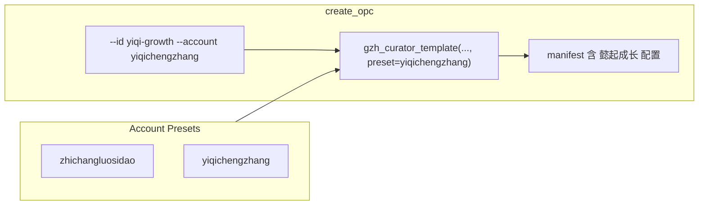

# gzh-curator 多账号架构优化方案

## 一、现状梳理

### 数据流

```mermaid
flowchart TB
    subgraph create [创建阶段]
        CLI["opc opc create --id gzh-curator --name ... --from-template gzh-curator"]
        loadTpl["load_template(gzh-curator)"]
        gzhTpl["gzh_curator_template()"]
        spec["weekly-topic-batch.v2.json"]
        pd["extract_planning_defaults(spec)"]
        manifest["manifest.json 写入 .opc/opcs/gzh-curator/"]
    end
    subgraph run [运行阶段]
        runCmd["scenario run --opc gzh-curator"]
        getDefaults["get_planning_defaults(opc_id)"]
        mf["manifest 覆盖 template defaults"]
        inputs["merged_inputs 传入 executor"]
    end
    CLI --> loadTpl --> gzhTpl
    gzhTpl --> spec --> pd --> manifest
    runCmd --> getDefaults --> mf --> inputs
```




### 关键发现


| 环节         | 现状                                               | 问题                                                                  |
| ---------- | ------------------------------------------------ | ------------------------------------------------------------------- |
| 模板         | 单一 `gzh-curator` 加载 `weekly-topic-batch.v2.json` | defaults 中 objective、target_account、reference_accounts 均硬编码为「职场螺丝刀」 |
| create_opc | 仅接收 `opc_id, name, template`                     | 无法为不同账号传入差异化配置                                                      |
| manifest   | 由 `gzh_curator_template()` 从 spec 提取             | 新建 OPC 时必然拿到模板中的 职场螺丝刀 配置                                           |
| 运行期        | `get_planning_defaults()` 用 manifest 覆盖 template | **manifest 是运行时默认值来源**，因此每个 OPC 应有自己的 manifest 配置                   |


**结论**：create 阶段无法为不同账号写入不同的 manifest，是核心瓶颈。当前若要支持「懿起成长」，只能手动创建后编辑 `.opc/opcs/<id>/manifest.json`，既不便捷也不易维护。

**设计原则**：按新项目首版设计，不做历史兼容分支；本期仅面向 `gzh-curator` 模板落地。

---

## 二、方案：Account Presets

### 2.1 思路

- 新增 **account presets** 配置，将「职场螺丝刀」「懿起成长」等账号的 objective、references、target_account、source_data_dir 等集中管理
- 扩展 `create_opc`：当 `template=gzh-curator` 时，`account_preset` **必填**，从 preset 覆盖 manifest
- **场景结构与 agent 定义**保持不变；**account 相关默认值**从 template 移除，统一由 preset/manifest 提供，避免重复、困惑与错误
- **manifest 显式存 `account_preset`**：create 时写入，运行前 sync 时从 manifest 读出并传给 `load_template`，create 与 sync 共用同一套 `load_template` 逻辑，不推导
- **运行期 inputs 合并**：manifest 作 base，caller 传入的 inputs（文件/表单/CLI 覆盖）覆盖 manifest；**合并逻辑只在一个函数内实现**，`run_scenario` / `start_scenario_run` / `retry_scenario_run` / `start_retry_scenario_run` 仅调用该函数，不做硬编码默认值回退

### 2.2 架构（优化后）




### 2.3 新增文件

`**opc_platform/templates/gzh-curator-accounts.json**`

```json
{
  "zhichangluosidao": {
    "target_account": "职场螺丝刀",
    "objective": "聊职场生存与升职技能，每日更新，每篇文章内容字数强约束在1000字-1100字。",
    "references": ["刘润", "职场知行先锋", "栩先生", "MBA智库"],
    "source_data_dir": "",
    "name": "职场螺丝刀GzhCuratorOpc"
  },
  "yiqichengzhang": {
    "target_account": "懿起成长",
    "objective": "一个37岁的土木工程师爸爸，记录10岁四年级儿子大懿和7岁一年级女儿小懿的成长过程、优质陪伴和教育经验等。每日更新，每篇文章内容字数强约束在1000字-1100字。",
    "references": ["贼娃","普娃","三个妈妈六个娃","三秦家长学校"],
    "source_data_dir": "",
    "name": "懿起成长GzhCuratorOpc"
  }
}
```

- preset key 为 slug（如 `yiqichengzhang`），与 `target_account_to_slug` 生成结果一致
- preset 中的 `name` 作为默认 `manifest.name`；若 create 显式传入 `name`，以用户输入为准
- `source_data_dir` 本期纳入 account 扩展，不同账号可配置不同预抓取目录；空字符串表示走抓取流程

---

## 三、实现要点

### 3.1 修改清单


| 文件                                                                                                     | 变更                                                                                                                                                                                                                                                                 |
| ------------------------------------------------------------------------------------------------------ | ------------------------------------------------------------------------------------------------------------------------------------------------------------------------------------------------------------------------------------------------------------------ |
| [opc_platform/templates/weekly-topic-batch.v2.json](opc_platform/templates/weekly-topic-batch.v2.json) | **移除与 preset 重复的 account 相关字段**：`defaults.objective`→`""`；`defaults.reference_accounts`→`[]`；`defaults.source_data_dir`→`""`；`inputs_schema.properties.target_account.default`→`""`；`inputs_schema.properties.source_data_dir.default`→`""`。详见 3.5。 |
| [opc_platform/templates/gzh-curator-accounts.json](opc_platform/templates/gzh-curator-accounts.json)   | 新建，存放账号 preset 配置                                                                                                                                                                                                                                                 |
| [opc_platform/domain/templates.py](opc_platform/domain/templates.py)                                   | 1) 新增 `load_gzh_curator_presets()`（路径 `opc_platform/templates/gzh-curator-accounts.json`）：文件不存在→`FileNotFoundError`；JSON 解析失败→`ValueError`；返回空 dict 时 preset key 校验会报错 2) `gzh_curator_template(opc_id, name, account_preset: str)` 必填 3) `load_template(..., account_preset: str | None)`：仅当 `template_name=="gzh-curator"` 时 account_preset 必填并透传 4) preset 不存在或必填字段缺失/类型错误（尤其 `references` 必须是非空字符串数组）则报错 5) manifest 须包含 `account_preset`（供 sync 读取） |
| [opc_platform/commands/opc_commands.py](opc_platform/commands/opc_commands.py)                         | `create_opc(..., account_preset: str | None)` 必填（template 为 gzh-curator 时），**在 create_opc 内统一校验**（CLI/Web 行为一致）；缺省则 `raise ValueError`。写入 catalog 的 `name` 使用 `tpl["manifest"]["name"]`，与 manifest 一致。新增 `list_presets(root)`：调用 `templates.load_gzh_curator_presets()` 后 map 为 `[{"key","target_account","name"},...]` |
| [opc_platform/entrypoints/cli.py](opc_platform/entrypoints/cli.py)                                     | `opc create` 增加 `--account`，并在 `--from-template gzh-curator` 时必填                                                                                                                                                                                                 |
| [opc_platform/commands/run_commands.py](opc_platform/commands/run_commands.py)                         | `_sync_scenario_with_template`：当 `template_name=="gzh-curator"` 时，从 manifest 读取 `account_preset`，传给 `load_template`。`run_scenario` / `start_scenario_run` / `retry_scenario_run` / `start_retry_scenario_run` 在调用 `execute_run` 前都必须：加载 manifest，调用 **唯一合并函数** `merge_run_inputs(manifest, inputs)`，将返回值作为 inputs 传入 execute_run |
| [opc_platform/commands/opc_commands.py](opc_platform/commands/opc_commands.py)（合并函数）             | 新增 **唯一实现合并逻辑的函数** `merge_run_inputs(manifest: dict, inputs: dict) -> dict`：base = manifest 规划相关字段（objective、target_account、reference_accounts←manifest.references、source_data_dir、topic_days 等），返回 `{**base, **inputs}`；不做任何硬编码默认值回退。CLI/Web 仅传各自收集的 inputs，运行入口（run/start/retry）统一调用此函数 |
| [opc_platform/runtime/executor.py](opc_platform/runtime/executor.py)                                   | 移除 target_account、reference_accounts 的硬编码回退（如 "职场螺丝刀"、[]）；仅使用传入的 merged_inputs，缺则空 |
| [opc_platform/commands/web_commands.py](opc_platform/commands/web_commands.py)                         | `createOpc` 的 `account_preset` **仅当 template 为 gzh-curator 时必填**；新增 GET `/api/opc/presets` 返回 `{"presets":[{"key","target_account","name"},...]}`。**路由顺序**：必须在 `path.startswith("/api/opc/")` 分支之前单独处理 `path == "/api/opc/presets"`，否则会被误识别为 `describe_opc(root, "presets")` |
| [web/src/api.ts](web/src/api.ts)、[web/src/App.tsx](web/src/App.tsx) 等                                  | **必选**：`api.ts` 新增 `presets: () => req("/api/opc/presets")`；`createOpc` 的 payload 增加 `account_preset?`；config 类型增加 `default_opc_create.account_preset`。`App.tsx`：① **手动创建 OPC 表单**：放在工作台空状态（opcs.length===0）时，作为「创建 OPC 并开始」旁的次要按钮「手动创建」展开；或 OPC 下拉旁的「新建」入口；字段 opc_id、name、template、account_preset 下拉（gzh-curator 时必选）② createDefaultOpc 从 config 传入 `account_preset` ③ **空状态**：在 `planningDefaults` 的 useEffect 开头加 `if (opcs.length === 0) return`，并将 `opcs` 加入依赖；展示「暂无 OPC，请先创建」 |

### 3.2 核心逻辑（templates.py）

```python
# 伪代码（显式校验，避免 or 回退到空值）
REQUIRED = ("target_account", "objective", "references")

def gzh_curator_template(opc_id: str, name: str, account_preset: str) -> dict:
    spec = _load_weekly_spec()
    pd = extract_planning_defaults(spec)  # 模板默认值
    presets = _load_gzh_curator_presets()
    p = presets.get(account_preset)
    if not p:
        raise ValueError(f"unknown account_preset: {account_preset}")
    for key in REQUIRED:
        val = p.get("references") if key == "references" else p.get(key)
        if val is None or (isinstance(val, (list, str)) and not val):
            raise ValueError(f"preset {account_preset} missing required field: {key}")
    pd["target_account"] = p["target_account"]
    pd["objective"] = p["objective"]
    pd["reference_accounts"] = p["references"]
    pd["source_data_dir"] = str(p.get("source_data_dir") or "")
    explicit_name = str(name or "").strip()
    resolved_name = explicit_name or str(p.get("name") or "").strip() or opc_id
    manifest = {
        "name": resolved_name,  # 显式 name 优先；缺省才回落到 preset.name
        "opc_id": opc_id,
        "account_preset": account_preset,  # sync 时从 manifest 读出并传给 load_template
        ...
    }  # 使用 pd 构建
    return {"manifest": manifest, "scenarios": {...}}
```

- **必须**指定 `account_preset`，未指定或 preset 不存在则报错
- preset 必填字段：target_account、objective、references；缺失则报错
- 字段类型强校验：`target_account/objective` 必须为非空字符串；`references` 必须为非空数组且元素为非空字符串；`source_data_dir` 若存在必须为字符串
- `source_data_dir` 从 preset 覆盖，空串表示走抓取流程
- manifest 必须包含 `account_preset` 字段，供 `_sync_scenario_with_template` 读取并传给 `load_template`

### 3.2b sync 与 create 共用 load_template

`_sync_scenario_with_template` 在运行入口执行，用于在运行前用模板刷新 scenario 文件。当 `template_name=="gzh-curator"` 时，从 manifest 读取 `account_preset`，传入 `load_template`，create 与 sync 共用同一套逻辑。

### 3.2c 运行期 inputs 合并（单一函数，避免多头维护）

- **合并规则**：manifest 作为 base，caller 传入的 inputs（`--input` 文件 / Web 表单 / `--topic-days`、`--source-data-dir` 等）覆盖 base；**不做** target_account、reference_accounts 等硬编码默认值回退。
- **安全规则（source_data_dir）**：若 inputs 中显式传入 `source_data_dir`，在进入 executor 前做路径片段校验，拒绝包含 `..` 的值；仅允许普通目录路径字符串（空串继续表示走抓取流程）。
- **唯一实现位置**：`opc_commands.merge_run_inputs(manifest, inputs) -> dict`。从 manifest 取出规划相关字段（objective、target_account、reference_accounts←manifest.references、source_data_dir、topic_days 等），构造 base，返回 `{**base, **inputs}`。**全项目仅此一处实现合并逻辑**，其余只调用。
- **调用链**：`run_scenario`、`start_scenario_run`、`retry_scenario_run`、`start_retry_scenario_run` 均在调用 `execute_run` 前加载 manifest 并调用 `merge_run_inputs(manifest, inputs)`；CLI/Web 仍只负责收集 inputs 并传给运行入口，不自行做 manifest 合并。
- **executor**：不再从 spec.defaults 补 objective/target_account/reference_accounts；移除对「职场螺丝刀」、`[]` 的硬编码回退，仅使用传入的 merged_inputs。

### 3.3 创建「懿起成长」实例的命令

```bash
# CLI（--account 必填）
opc opc create --id yiqi-growth --name "懿起成长GzhCuratorOpc" --from-template gzh-curator --account yiqichengzhang
```

职场螺丝刀：

```bash
opc opc create --id gzh-curator --name "职场螺丝刀GzhCuratorOpc" --from-template gzh-curator --account zhichangluosidao
```

执行后 `.opc/opcs/yiqi-growth/manifest.json` 将包含 懿起成长 的 objective、references、target_account、source_data_dir、account_preset。

### 3.4 运行

```bash
opc scenario run --opc yiqi-growth --scenario weekly-topic-batch --input ./input.json
```

`get_planning_defaults(root, "weekly-topic-batch", "yiqi-growth")` 会从 manifest 读取 懿起成长 的配置，无需额外改动。

### 3.5 移除 template 中的重复字段（weekly-topic-batch.v2.json）


| 位置                                                 | 修改前                           | 修改后  |
| -------------------------------------------------- | ----------------------------- | ---- |
| `defaults.objective`                               | 职场螺丝刀相关文案                     | `""` |
| `defaults.reference_accounts`                      | `["刘润", ...]`                 | `[]` |
| `defaults.source_data_dir`                         | `"~/Codes/agent-skills/data"` | `""` |
| `inputs_schema.properties.target_account.default`  | `"职场螺丝刀"`                     | `""` |
| `inputs_schema.properties.source_data_dir.default` | `""` 或具体路径                    | `""` |


template 仅保留 scenario 结构与通用默认值（topic_days、ai_tone）；account 与 source_data_dir 均由 preset/manifest 提供。

---

## 四、前端与 Web API（必选）

### 4.1 创建入口

- 保留两个入口：一键创建默认 OPC、手动创建 OPC
- 手动创建字段：`opc_id`、`name`、`template`、`account_preset`（当 template 为 `gzh-curator` 时必填）
- `default_opc_create` 增加 `account_preset`，用于一键创建

### 4.2 API 约束

- `POST /api/opc/create`：当 `template=gzh-curator` 且缺 `account_preset` 时返回 400
- 新增 `GET /api/opc/presets`，返回 `{"presets":[{"key","target_account","name"}, ...]}`
- 路由顺序约束：`path == "/api/opc/presets"` 必须先于 `path.startswith("/api/opc/")`
- `GET /api/planning-defaults`：`opc_id` 为空/非法/objective 缺失时返回 400（`error: 请先创建或选择 OPC`）

### 4.3 空状态

- OPC 列表为空时不调用 `/api/planning-defaults`
- 前端展示「暂无 OPC，请先创建」
- `planningDefaults` 的 useEffect 增加 `if (opcs.length === 0) return`，并将 `opcs` 加入依赖

---

## 五、实施计划（精简）

1. 新建 `gzh-curator-accounts.json`，仅包含 `target_account/objective/references/source_data_dir/name`
2. 修改 `templates.py`：新增 preset 加载；`gzh_curator_template`/`load_template` 支持并强制 `account_preset`
3. 修改 `opc_commands.py`：`create_opc` 校验 `account_preset`；新增 `list_presets(root)`；新增 `merge_run_inputs(manifest, inputs)`
4. 修改 `run_commands.py`：`run_scenario/start_scenario_run/retry_scenario_run/start_retry_scenario_run` 全部调用 `merge_run_inputs`
5. 修改 `executor.py`：移除 target_account/reference_accounts 的硬编码回退
6. 修改 `cli.py` 与 `web_commands.py`：增加 `--account` 与 `GET /api/opc/presets`
7. 前端改造：创建表单支持 `account_preset`；默认创建透传 `account_preset`；空状态不请求 planning-defaults
8. 更新测试：CLI create 校验、preset 场景创建、Web presets 路由顺序、`/api/scenario/start` 合并行为

---

## 六、验收标准（上线门禁）

| 验收项 | 通过标准 |
|--------|----------|
| create（CLI） | `gzh-curator` 缺 `--account` 时失败；合法 preset 成功并写入 `manifest.account_preset` |
| create（Web） | `POST /api/opc/create` 在 `template=gzh-curator` 且缺 `account_preset` 返回 400 |
| presets 接口 | `GET /api/opc/presets` 返回 `presets[]`，且不被 `/api/opc/{id}` 路由吞没 |
| 运行入口一致 | `/api/scenario/run` 与 `/api/scenario/start` 均从 manifest 合并默认 inputs |
| executor 回退清理 | 不再硬编码回退到「职场螺丝刀」或空 references |
| 空状态 | 无 OPC 时前端不调用 planning-defaults，并展示创建引导 |

---

## 七、工程约束（只保留必要项）

- `source_data_dir` 若由外部输入覆盖，必须拒绝包含 `..` 的值
- `target_account_to_slug("懿起成长")` 需有单测，确保与 copublisher 账户参数一致
- manifest/catalog/scenario 写入继续使用原子写（tmp + rename）
